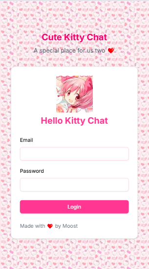
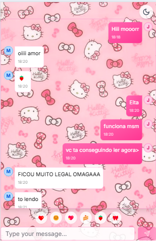

# Hello Kitty Chat 💖

Um chat encantador com tema Hello Kitty desenvolvido como desafio pessoal para oferecer uma experiência de mensagens simples e adorável.

  

## ✨ Motivação

Minha namorada mencionou que não era fã da interface do Instagram, que usávamos frequentemente para conversar. Decidi criar uma alternativa:

- 🎨 UI minimalista e fofa
- 💬 Sistema de chat em tempo real
- 🐱 Tema Hello Kitty personalizado
- 🚀 Desafio técnico pessoal

## 🌟 Funcionalidades Principais

- **Chat em Tempo Real** usando SSE (Server-Sent Events)
- **Tema Dark/Light Mode** automático
- **Background Temático** Hello Kitty
- **Animações Suaves** de mensagens
- **Sistema de Emojis** rápido
- **Responsivo** para mobile
- **Autenticação** integrada (NextAuth)

## 🛠 Tecnologias

**Frontend:**
- Next.js 14
- TypeScript
- Framer Motion (animations)
- Tailwind CSS
- Shadcn/ui

**Backend:**
- Mongo DB
- Server-Sent Events (SSE)
- Next API Routes
- Prisma (ORM)

**Infra:**
- Vercel 

## 🔧 Funcionamento Técnico

### Sistema de SSE
Implementação de Server-Sent Events para atualização em tempo real sem WebSockets

## 📸 Screenshots  
--- | ---  
 | 

## 🤝 Como Contribuir
1. Faça um **Fork** do projeto.
2. Crie sua **Feature Branch**: `git checkout -b feature/NovaFeature`.
3. Commit suas mudanças: `git commit -m 'Add NovaFeature'`.
4. Push para a Branch: `git push origin feature/NovaFeature`.
5. Abra um **Pull Request**.

## 📝 Licença
Este projeto está licenciado sob a **Licença MIT** - veja o arquivo `LICENSE` para detalhes.

Feito com ❤️ por [MoostDev - Joao Gionda]  
📧 Contato: [moostdev@gmail.com]  
🐱 Inspirado no universo Hello Kitty (uso educacional)
