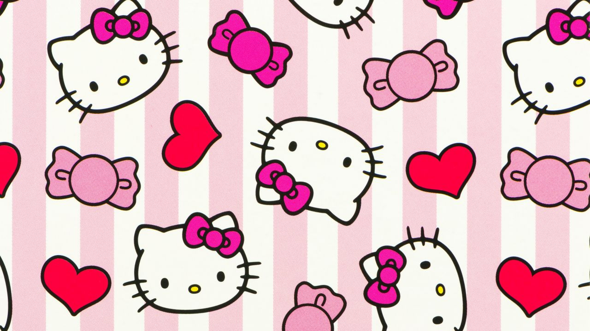

# Hello Kitty Chat 💖

Um chat encantador com tema Hello Kitty desenvolvido como desafio pessoal para oferecer uma experiência de mensagens simples e adorável.

  

## ✨ Motivação

Minha namorada mencionou que não era fã da interface do Instagram, que usávamos frequentemente para conversar. Decidi criar uma alternativa:

- 🎨 UI minimalista e fofa
- 💬 Sistema de chat em tempo real
- 🐱 Tema Hello Kitty personalizado
- 🚀 Desafio técnico pessoal

## 🌟 Funcionalidades Principais

- **Chat em Tempo Real** usando SSE (Server-Sent Events)
- **Tema Dark/Light Mode** automático
- **Background Temático** Hello Kitty
- **Animações Suaves** de mensagens
- **Sistema de Emojis** rápido
- **Responsivo** para mobile
- **Autenticação** integrada (NextAuth)

## 🛠 Tecnologias

**Frontend:**
- Next.js 14
- TypeScript
- Framer Motion (animations)
- Tailwind CSS
- Shadcn/ui

**Backend:**
- Mongo DB
- Server-Sent Events (SSE)
- Next API Routes
- Prisma (ORM)

**Infra:**
- Vercel Hosting
- PlanetScale (Database)

## 🚀 Como Executar Localmente

## 🔧 Funcionamento Técnico

### Sistema de SSE
Implementação de Server-Sent Events para atualização em tempo real sem WebSockets:

